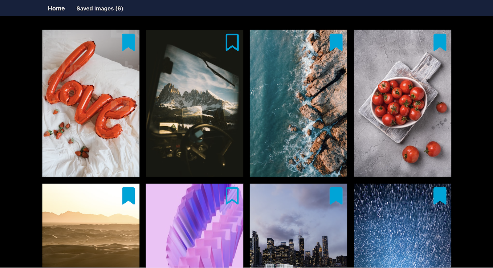

# Save Your Faves

## Created By: 
- [DongChoi](https://github.com/DongChoi)
- [NecoLanch](https://github.com/Necolanch)
- [dmcconeghy](https://github.com/dmcconeghy)
- [DirtyHoops](https://github.com/dirtyhoops)

## Summary:
This project was created for a weekend Quackathon for the [#DearJuniorDev Discord Community](https://discord.gg/ZNzK3YeG).

The sprint's task? 

>"Create a static photo gallery that allows your website's visitor to pin their favorite pictures onto a separate page using the concept of local storage".

Our team [bootstrapped a React App](https://github.com/facebook/create-react-app) with two pages, one for saving favorite images from a random pool and a second for displaying saved favorites. We saved image data in local storage using an object with id:url pairs collected from previously fetched Unsplashed API call to avoid API rate limits during mvp building or demonstration. 

Our team is pleased with the work we've done over a few hours spread across a weekend. All of our team members learned new skills and techniques, and everyone had a significant contribution to the final product. (Merges made from one user often contain work done using pair programming.) We see plenty to be proud of and plenty that we'd be eager to develop further. 

Thanks to the DJD community for a great event. 

## Visit the Site:
[Our site is deployed with Netlifly](https://main--meek-genie-b218c4.netlify.app/)

## Local Deployment
To explore our project from your own IDE: 

### Clone our repo.
`https://github.com/DongChoi/Quackathon-save-your-fav-image.git`

### Install requirements. 
`npm install` 

### Start the server. 
`npm start` 
